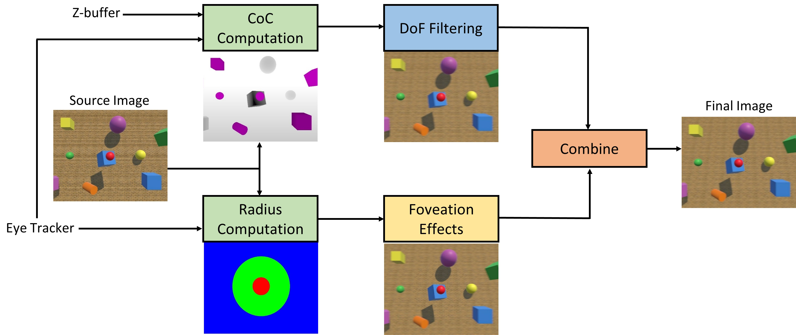

# Serious Games

# VR Locomotion 

# Accommodation Vergence Conflict

# Foveated Depth-of-Field

The foveated depth-of-field technique in VR aims to create a more realistic visual experience by mimicking how human vision works. Current VR headsets display everything in sharp focus, leading to visual fatigue. In reality, humans focus on objects at different distances, causing other objects to appear out-of-focus. This natural viewing process is often referred to as depth-of-field (DoF). Foveated imaging adjusts the resolution based on the eye's fixation point, decreasing resolution towards the periphery. The foveated depth-of-field techniqe takes inspiration from the human physiological system and the optical characteristics of lenses to produce a high fidelity central region and reduced resolution in the periphery based on object distances. The technique offers smooth transitions during eye movements, real-time performance and reduced visual artifacts.
