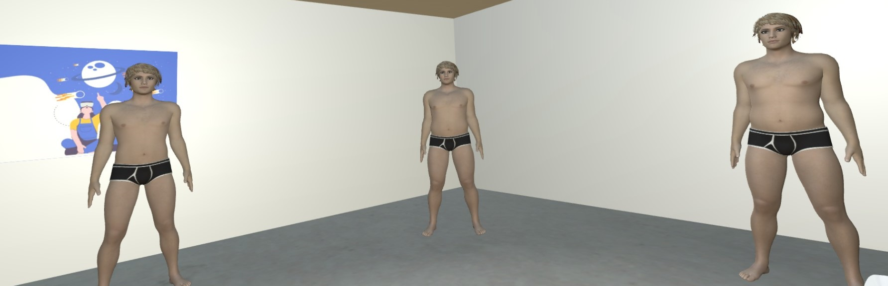

# Depth Perception

A critical factor in designing effective virtual reality systems is the accurate representation of depth and spatial layout, as depth perception is essential for seamless human interaction with virtual environments. This research explores innovative approaches to enhancing spatial awareness and visual realism, emphasizing gaze-contingent focus cues, advanced visualization techniques, and intuitive locomotion methods. The goal is to optimize user experience and interaction within immersive extended reality applications.

 

# Accommodation Vergence Conflict

Recently, immersive media devices have surged in popularity, yet several issues persist. Depth perception is vital for human interaction with the environment, relying on convergence and accommodation for key depth cues. In virtual environments, these cues often mismatch, causing discomfort and impairing distance perception. To resolve this issue, we've developed a technique incorporating inverse blurring into immersive media devices. Using a novel approach to classical Wiener deconvolution, this technique operates without an eye-tracker and is implemented in a commercial immersive media device. [[LINK](https://ieeexplore.ieee.org/stamp/stamp.jsp?tp=&arnumber=10315149)]

 

# Foveated Depth-of-Field

The foveated depth-of-field technique in VR aims to create a more realistic visual experience by mimicking how human vision works. Current VR headsets display everything in sharp focus, leading to visual fatigue. In reality, humans focus on objects at different distances, causing other objects to appear out-of-focus. This natural viewing process is often referred to as depth-of-field (DoF). Foveated imaging adjusts the resolution based on the eye's fixation point, decreasing resolution towards the periphery. The foveated depth-of-field techniqe takes inspiration from the human physiological system and the optical characteristics of lenses to produce a high fidelity central region and reduced resolution in the periphery based on object distances. The technique offers smooth transitions during eye movements, real-time performance and reduced visual artifacts. [[LINK](https://github.com/RazeenHussain/FoveatedDoF_VR)]

 

# Serious Games
- **Choisis:**

Choisis is a serious game developed to offer clinicians objective measures in assessing apathy, a disorder characterized by reduced self-initiated activity. It focuses on evaluating difficulties in decision-making, a key aspect of apathy, using response times in increasingly challenging choice scenarios. The game is available for Android and WebGL. It has been developed in collaboration between University of Genoa and COBTEK lab. [[DEMO](https://razeenhussain.itch.io/choisis)]

- **ApathySEED:**

ApathySEED is an Android-based serious game designed to assess social apathy in individuals with mild cognitive impairment. Tailored for elderly users, it replaces traditional paper-based methods with intuitive gameplay that simulates real-life social interactions. The serious game is aligned with clinical diagnostic criteria and offers a reliable, engaging, and accessible tool for evaluating social apathy in cognitive impairments.

- **OurMind:**

The OurMind project leverages virtual reality technology to create an interactive virtual environment for psychological tests and patient assessments. The main goal is to gather data and analyze patient reactions to 360° video scenarios, enhancing diagnostic accuracy and aiding the care or treatment process. The project has been developed in collaboration between University of Genoa, BBS and ASL1. 

- **BIVRA:**

BIVRA is a VR-based serious game designed to assess and support the treatment of eating disorders, body image concerns, and self-confidence issues. Through immersive and interactive scenarios, BIVRA provides users with a safe, controlled environment to explore and address their perceptions of body image, fostering therapeutic insights and promoting mental well-being.
